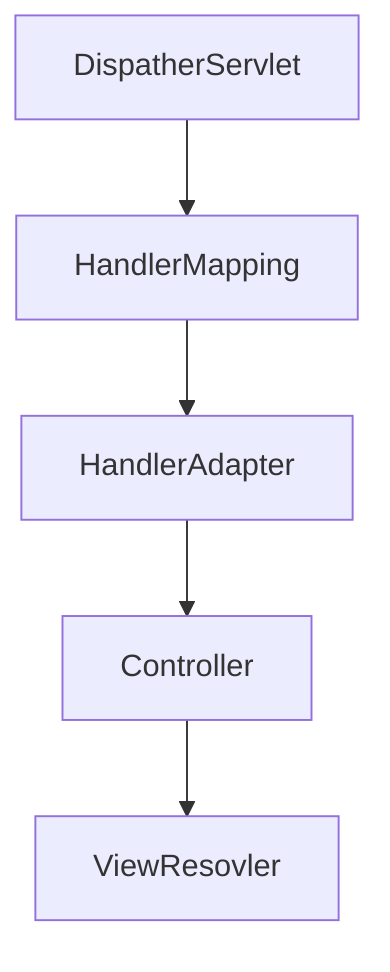

# SpringMVC

### SpringMVC中重要的组件

- DispacherServlet

  前端控制器，接收所有请求(可以配置不包含jsp)

- HandlerMapping

  解析请求格式。判断希望要执行哪个具体的方法

- HandlerAdapter

  负责调用具体的方法

- ​                                                                                                                                                                                                                                                                                                                                                                                                                                                                                                                                                                                                                                                                                                                                                                                                                                                                                                                                                                                                                                                                                                                                                                                                                                                                                                                   ViewResovler

  解析结果，准备跳转到物理视图上。




### 入门体验

1. 创建web项目

2. 编写web.xml，在其中注册一个特殊的servlet,前端控制器(DispatherServlet)

   ```xml
   <?xml version="1.0" encoding="UTF-8"?>
   <web-app version="3.0"
            xmlns="http://java.sun.com/xml/ns/javaee"
            xmlns:xsi="http://www.w3.org/2001/XMLSchema-instance"
            xsi:schemaLocation="http://java.sun.com/xml/ns/javaee http://java.sun.com/xml/ns/javaee/web-app_3_0.xsd">
     <servlet>
       <!--这个名字是有讲究的
        如果不修改spring默认配置文件的位置，那么springmvc会去web-inf下面找一个叫做springmvc-servlet.xml的文件
       -->
       <servlet-name>springmvc</servlet-name>
       <servlet-class>org.springframework.web.servlet.DispatcherServlet</servlet-class>
                 <!--配置文件路径-->
           <init-param>
               <param-name>contextConfigLocation</param-name>
               <param-value>classpath:1.xml</param-value>
           </init-param>
     </servlet>
     <servlet-mapping>
       <servlet-name>springmvc</servlet-name>
       <url-pattern>/</url-pattern>
     </servlet-mapping>
   </web-app>
   ```

3. 编写一个springmvc配置文件

   注册一个视图解析器

   ```xml
   <?xml version="1.0" encoding="UTF-8"?>
   <beans xmlns="http://www.springframework.org/schema/beans"
          xmlns:xsi="http://www.w3.org/2001/XMLSchema-instance"
          xsi:schemaLocation="http://www.springframework.org/schema/beans http://www.springframework.org/schema/beans/spring-beans.xsd">
       <!--配置视图解析器
       常用内部资源视图解析器
       -->
       <bean class="org.springframework.web.servlet.view.InternalResourceViewResolver">
           <property name="prefix" value="/jsp/"/>
           <property name="suffix" value=".jsp"/>
       </bean>
   </beans>
   ```

   

4. 编写控制器

   ```java
   public class HelloController implements Controller {
       //如果 servlet是红色的，需要在maven中添加servletAPI的依赖
       @Override
       public ModelAndView handleRequest(javax.servlet.http.HttpServletRequest httpServletRequest, javax.servlet.http.HttpServletResponse httpServletResponse) throws Exception {
               ModelAndView modelAndView = new ModelAndView();
               modelAndView.addObject("girl","菲菲");
               modelAndView.setViewName("girl");
           return modelAndView;
       }
   }
   ```

   注册控制器

   ```xml
   <?xml version="1.0" encoding="UTF-8"?>
   <beans xmlns="http://www.springframework.org/schema/beans"
          xmlns:xsi="http://www.w3.org/2001/XMLSchema-instance"
          xsi:schemaLocation="http://www.springframework.org/schema/beans http://www.springframework.org/schema/beans/spring-beans.xsd">
       <!--配置视图解析器
       常用内部资源视图解析器
       -->
       <bean class="org.springframework.web.servlet.view.InternalResourceViewResolver">
           <property name="prefix" value="/jsp/"/>
           <property name="suffix" value=".jsp"/>
       </bean>
       <bean class="com.cy.controller.HelloController" name="/helloController"/>
   </beans>
   ```

5. 编写结果页面

```jsp
<%--
  Created by IntelliJ IDEA.
  User: 陈勇
  Date: 2019/2/2
  Time: 21:09
  To change this template use File | Settings | File Templates.
--%>
<%@ page contentType="text/html;charset=UTF-8" language="java" %>
<html>
<head>
    <title>Title</title>
</head>
<body>
    我的脑海：${girl}
</body>
</html>
```

### SpringMVC运行的流程


### 组件分析

##### web.xml

注册前端控制器，目的在于让springmvc去拦截所有控制器请求

```xml
  <servlet-name>springmvc</servlet-name>
  <servlet-class>org.springframework.web.servlet.DispatcherServlet</servlet-class>
</servlet>
<servlet-mapping>
  <servlet-name>springmvc</servlet-name>
  <url-pattern>/</url-pattern>
</servlet-mapping>
```

##### `url-pattern`的写法：

- /

  不拦截jsp页面

- /*(永远不要这么写)

  拦截所有请求

- *.do

  有的团队习惯将请求的行为加个小尾巴用来区分

### 关于前端控制器的解释

1. springmvc的设计理念是希望开发者尽量原理原生servletAPI。因为原生servletAPI相当的繁琐，将操作进一步简化。
2. 它将很多东西的责任进行了拆分。
3. SpringMVC是基于servlet设计的。

### 配置文件名指定

在配置servlet的时候可以指定init-param。

```xml
<servlet>
  <!--这个名字是有讲究的
   如果不修改spring默认配置文件的位置，那么springmvc会去web-inf下面找一个叫做springmvc-servlet.xmld额文件
  -->
  <servlet-name>springmvc</servlet-name>
  <servlet-class>org.springframework.web.servlet.DispatcherServlet</servlet-class>
    
    
  <init-param>
    <param-name>namespace</param-name>
    <param-value>1</param-value>
  </init-param>
    
    
</servlet>
<servlet-mapping>
  <servlet-name>springmvc</servlet-name>
  <url-pattern>/</url-pattern>
</servlet-mapping>
```

### 声明配置文件的路径

```xml
<init-param>
  <param-name>contextConfigLocation</param-name>
  <param-value>classpath:1.xml</param-value>
</init-param>
```

### 视图解析器

springmvc支持多种视图技术

- jsp
- freemaker(模板技术)

内部资源视图解析器（InternalResourceViewResolver）

- 视图前缀

  /jsp/它是我们的请求响应的资源的路径配置

- 视图后缀

  视图文件的后缀名

  物理视图由逻辑视图转换而来。即 物理视图=prefix+逻辑视图名称+suffix

### 请求转发与重定向

- 请求转发

  return "视图的逻辑名"

- 请求重定向

  return "redirect:视图名"


### 静态资源访问

springMvc默认拦截所有请求，如果需要访问静态资源，则需要进行相应的配置。

解决方案1：

```xml
<!--把静态资源请求交给tomcat容器-->
<mvc:default-servlet-handler/>
<mvc:annotation-driven/>
```

解决方案2:

```xml
<!-- mapping中 *表示当前路径下的所有文件，**表示当前路径下的所有文件以及子文件 -->
<!-- mapping为请求URL -->
<!-- location为静态资源的地址 -->
<!--/代表当前项目的路径即contextPath-->
 <mvc:resources location="/static/css/" mapping="/static/css/**"/>
```
### 乱码解决

配置web.xml

```xml
<filter>
    <filter-name>characterEncodingFilter</filter-name>
    <filter-class>org.springframework.web.filter.CharacterEncodingFilter</filter-class>
    <init-param>
        <param-name>encoding</param-name>
        <param-value>UTF-8</param-value>
    </init-param>
    <init-param>
        <param-name>forceRequestEncoding</param-name>
        <param-value>true</param-value>
    </init-param>
    <init-param>
        <param-name>forceResponseEncoding</param-name>
        <param-value>true</param-value>
    </init-param>
</filter>
<filter-mapping>
        <filter-name>characterEncodingFilter</filter-name>
        <url-pattern>/*</url-pattern>
    </filter-mapping>

```


### 参数传递

1. 通过自动装配

   表单中的name属性的值与参数名字相同

2. 使用@RequestParam绑定

3. 通过@PathVariable绑定

4. 自动装配对象


### 返回Json

引入Jackson相关依赖

```xml
<!-- https://mvnrepository.com/artifact/com.fasterxml.jackson.core/jackson-databind -->
<dependency>
  <groupId>com.fasterxml.jackson.core</groupId>
  <artifactId>jackson-databind</artifactId>
  <version>2.9.8</version>
</dependency>
<!-- https://mvnrepository.com/artifact/com.fasterxml.jackson.core/jackson-core -->
<dependency>
  <groupId>com.fasterxml.jackson.core</groupId>
  <artifactId>jackson-core</artifactId>
  <version>2.9.8</version>
</dependency>
<!-- https://mvnrepository.com/artifact/com.fasterxml.jackson.core/jackson-annotations -->
<dependency>
  <groupId>com.fasterxml.jackson.core</groupId>
  <artifactId>jackson-annotations</artifactId>
  <version>2.9.8</version>
</dependency>
<!-- https://mvnrepository.com/artifact/net.sf.json-lib/json-lib -->
<dependency>
  <groupId>net.sf.json-lib</groupId>
  <artifactId>json-lib</artifactId>
  <version>2.4</version>
  <classifier>jdk15</classifier>
</dependency>
```

添加ResponseBody注解

```java
@RequestMapping("/getUser")
@ResponseBody
public User getUser(){
    User user =new User();
    user.setName("鬼剑士");
    user.setBirth(new Date());
    return user;
}
```

### 接收Json

使用@RequestBody注解来标记Json数据注入的参数

```java
@RequestMapping("/put")
public String putUser(@RequestBody User user, Model model){
    System.out.println(user);
    model.addAttribute("user",user);
    return "showUser";
}
```

### 上传文件

添加依赖

```xml
<!-- https://mvnrepository.com/artifact/commons-fileupload/commons-fileupload -->
<dependency>
    <groupId>commons-fileupload</groupId>
    <artifactId>commons-fileupload</artifactId>
    <version>1.3.3</version>
</dependency>
```

注册视图解析器

```xml
<!--文件上传解析器-->
<!--id必须是multipartResolver原因是 源代码中写死了这个名字-->
<bean id="multipartResolver" class="org.springframework.web.multipart.commons.CommonsMultipartResolver">
    <property name="maxUploadSize"   value="5242880"></property>
    <property name="defaultEncoding" value="utf-8"></property>
    <property name="maxUploadSizePerFile" value="1048576"></property>
</bean>
```

文件上传页面

form中要添加enctype="multipart/form-data"

```html
<form action="${ctxPath}/file/upload" method="post" enctype="multipart/form-data">
    <input type="file" name="file2222" value="选择文件">
    <input type="submit" value="提交">
</form>
```

参数中注入文件

```java
@RequestMapping("upload")
public String upload(@RequestParam("file2222")MultipartFile multipartFile){

    return "uploadSuccess";
}
```

MultipartFile的相关API

- `getName`

  返回表单元素`<input type="file" name="file222">`中的name

- `getOriginalFilename`

  获取文件名

- `isEmpty`

  判断文件是否为空

- `transferTo`

  保存文件

MultipartFile使用示例

​	单文件上传

```java
@RequestMapping("upload")
public String upload(@RequestParam("file2222")MultipartFile multipartFile, Model model){
    if (multipartFile!=null && !multipartFile.isEmpty()) {
        String originalFilename = multipartFile.getOriginalFilename();
        String fileNameWithoutExtension = originalFilename.substring(0, originalFilename.lastIndexOf('.'));
        String fileExtension = originalFilename.substring(originalFilename.lastIndexOf('.'));
        UUID uuid = UUID.randomUUID();
        String newFileName= uuid.toString()+fileExtension;
        File file = new File(uploadPath,newFileName);
        try {
            multipartFile.transferTo(file);
            model.addAttribute("fileName",fileNameWithoutExtension);
        } catch (IOException e) {
            e.printStackTrace();
        }


    }
    return "uploadSuccess";
}
```

​	多文件上传

```html
<form action="${ctxPath}/file/upload2" method="post" enctype="multipart/form-data">
    <input type="file" name="file" >
    <input type="file" name="file" >
    <input type="file" name="file" >
<input type="submit" value="上传">
</form>
```

```java
@RequestMapping("upload2")
String uploadFiles(@RequestParam("file") List<MultipartFile> multipartFiles,Model model){
    if (multipartFiles!=null && multipartFiles.size()>0) {
        List<String> fileNames = new ArrayList<>();
        for (MultipartFile multipartFile : multipartFiles) {
            String fileNameWithoutExtension = UploadFile(multipartFile);
            fileNames.add(fileNameWithoutExtension);
        }
        model.addAttribute("fileNames",fileNames);
    }

    return "uploadSuccess2";
}
```

其调用的UploadFile如下

```java
public static String UploadFile(@org.jetbrains.annotations.NotNull MultipartFile multipartFile) {
    String originalFilename = multipartFile.getOriginalFilename();
    String fileNameWithoutExtension = originalFilename.substring(0, originalFilename.lastIndexOf('.'));
    String fileExtension = originalFilename.substring(originalFilename.lastIndexOf('.'));
    UUID uuid = UUID.randomUUID();
    String newFileName= uuid.toString()+fileExtension;
    File file = new File(uploadPath,newFileName);
    try {
        multipartFile.transferTo(file);
    } catch (IOException e) {
        e.printStackTrace();
    }
    return  fileNameWithoutExtension;
}
```


### 下载文件

```java
@Controller
@RequestMapping("/download")
public class DownLoadController {

    private static String ROOT ="E:"+ File.separator;

    @RequestMapping("/{fileName:.+}")
    public String downloadFile(HttpServletResponse response,@PathVariable("fileName") String fileName){
        try {
            fileName = new String(fileName.getBytes("ISO8859-1"),"UTF-8");
        } catch (UnsupportedEncodingException e) {
            e.printStackTrace();
        }
        String fileExtension = fileName.substring(fileName.lastIndexOf(".")+1);
        response.setContentType("application/"+fileExtension);
        try {
            String utf8Name = new String(fileName.getBytes("utf-8"),"ISO8859-1");
            response.setHeader("Content-Disposition","attachment;filename=" + utf8Name);
        } catch (UnsupportedEncodingException e) {
            e.printStackTrace();
        }
        try {
            Files.copy(Paths.get(ROOT,fileName),response.getOutputStream());
        } catch (IOException e) {
            e.printStackTrace();
        }

        return "downloadSuccess";
    }
```

注意事项

1. 对于中文文件名需要先获取字符串的ISO8869-1字节数组，然后转码为UTF-8
2. 直接使用@PathVariable注入参数时，会把文件后缀删除。因此需要修改表达式
3. 设置相应头的时候应该把UTF-8格式的文件名转换为ISO8869-1以便于TOMCAT传输


### 拦截器

SpringMVC提供了拦截器，用于在访问控制器之前对请求进行拦截，并对请求类容进行修改。

通过HandlerInterceptor接口实现拦截器

##### 示例 

统计服务器处理请求所花费的时间。

> TimerInterceptor.java

```java
package interceptors;


import org.apache.log4j.Logger;
import org.springframework.web.servlet.HandlerInterceptor;
import org.springframework.web.servlet.ModelAndView;

import javax.servlet.http.HttpServletRequest;
import javax.servlet.http.HttpServletResponse;

public class TimerInterceptor implements HandlerInterceptor {
    private static final Logger LOGGER = Logger.getLogger(TimerInterceptor.class);

    @Override
    public boolean preHandle(HttpServletRequest request, HttpServletResponse response, Object handler) throws Exception {
        long start = System.currentTimeMillis();
        request.setAttribute("start",start);
        return true;
    }

    @Override
    public void postHandle(HttpServletRequest request, HttpServletResponse response, Object handler, ModelAndView modelAndView) throws Exception {
        long end = System.currentTimeMillis();
        long start = (long) request.getAttribute("start");
        System.out.println("服务器处理此次请求共花费了："+ (end-start)+"ms");
        LOGGER.fatal("服务器处理此次请求共花费了："+ (end-start)+"ms");
    }

    @Override
    public void afterCompletion(HttpServletRequest request, HttpServletResponse response, Object handler, Exception ex) throws Exception {

    }
}
```

> xml中注册interceptor

```xml
<mvc:interceptors>
    <mvc:interceptor>
        <mvc:mapping path="/**/*"/>
        <bean class="interceptors.TimerInterceptor"/>
    </mvc:interceptor>
</mvc:interceptors>
```

##### 拦截顺序

如果多个拦截器拦截同一个URL，配置在前面的优先拦截

拦截顺序：

```
前置拦截器1

前置拦截器2

前置拦截器3

后置拦截器3

后置拦截器2

后置拦截器1
```

##### 过滤器和拦截器的执行顺序

过滤器先于拦截器执行

### 常用注解

##### @RequestMapping

配置请求映射，可以传输人一个数组作为参数映射多个路径

`path`属性是value的别名。两者可以任意互换

path支持ant风格：

1. `?`代表任意一个字符，斜杠除外
2. `*`0到任意个字符
3. `**` 支持任意层路径，例如 /m3/**,可以匹配/m3/213/asdw/asdw

`method`属性限定请求的方式


`params`属性


在请求中必须给出yes参数才能访问该方法。


请求中必须给出yes和no参数，并且yes的值=1,no的值!=1才能访问该方法

`headers`

限制请求头。

`consumes`

限制媒体类型，例如

consumes={"aplication/*","text/plain"}

`produces`

限制响应的媒体类型

##### @GetMapping、@PostMapping

把@RequestMapping中的method限定成了对应的类型

##### @DeleteMapping

使用时需要在web.xml中注册一个支持所有类型请求的过滤器

```xml
<filter>
  <filter-name>hiddenHttpMethodFilter</filter-name>
  <filter-class>org.springframework.web.filter.HiddenHttpMethodFilter</filter-class>
</filter>
<filter-mapping>
  <filter-name>hiddenHttpMethodFilter</filter-name>
  <url-pattern>/*</url-pattern>
</filter-mapping>
```

同时在表单中需要添加一个隐藏域 

```html
<form action="${ctxPath}/del" method="post">
    <input name="_method" value="DELETE" type="hidden">
    <input type="submit" value="删除">
</form>
```

##### @PathVariable

从使用RESTful风格的URL中获取参数

```java
@RequestMapping("student/create/{name}/{gender}")
public String createStudent(HttpServletRequest request, @PathVariable("name")String name, @PathVariable String  gender){
    request.setAttribute("name",name);
    request.setAttribute("gender",gender);
    return "createStudent";
}
```

##### @RequestParm

将表单中的数据绑定到对应的参数上

```java
@RequestMapping("demo4")
public String demo4(@RequestParam("name")String username,@RequestParam("pwd")String password) throws IOException {
	username = new String(username.getBytes("ISO-8859-1"), "UTF-8");
	System.out.println(username);
	System.out.println(password);
	return "/main.jsp";
}
```


##### @ResponseBody

使用该注解后方法不再返回一个视图，而是在一个http请求的body中添加数据返回。

```java
@RequestMapping("student/create/{name}/{gender}")
@ResponseBody
public String createStudent(HttpServletRequest request, @PathVariable("name")String name, @PathVariable String  gender){
    request.setAttribute("name",name);
    request.setAttribute("gender",gender);
    return  name+"created";
}
```

配合Json相关包可以返回Json数据。

##### @ModelAttribute

被@ModelAttribute标记的方法会在该控制器内的所有方法执行之前执行,并将方法的返回值注入到Model中

```java
@ModelAttribute
public User Init(){
    User user = new User();
    user.setName("看完这集睡觉");
    return user;
}

@RequestMapping("/get")
public String getUser(Model model){
    boolean containsAttribute = model.containsAttribute("user");
    System.out.println(containsAttribute);
    return "getUser";
}
```

```html
<%@ page contentType="text/html;charset=UTF-8" language="java" %>
<html>
<head>
    <title>Title</title>
</head>
<body>
    ${user.name}
</body>
</html>
```

可以在控制器中某个方法的参数上加上该注解,如果表单中没有装配user,则从Model中获取user并装配。

```java
public String getUser2(@ModelAttribute User user){
    return "getUser";
}
```

##### @InitBinder

可以用于获取表单中的日期，具体用法自己查官方文档。

##### @DateTimeFormat

在pojo的Date类型的字段上面添加，用于注入时日期格式的绑定

```java
public class User {
    private String name;

    @DateTimeFormat(pattern = "yyyy-MM-dd")
    private Date  birth;

    public Date getBirth() {
        return birth;
    }

    public void setBirth(Date birth) {
        this.birth = birth;
    }

    public String getName() {
        return name;
    }

    public void setName(String name) {
        this.name = name;
    }
}
```

```html
<form action="${ctxPath}/user/put" method="post">
    <input type="text" name="name">
    <input type="date" name="birth">
    <input type="submit" value="提交">
</form>
```

##### @SessionAttributes

写在控制器上，当请求/student/put时，在自动装配Student时，同时也会将其放入session中。

```java
@Controller
@SessionAttributes("student")
@RequestMapping("/student")
public class StudentController {
    @RequestMapping("/put")
    public String putStudent(Student student){
        return "redirect:/jsp/showStudent.jsp";
    }
}
```

##### @SessionAttribute

把Session中的student注入到参数中，只有session中有student对象时，才能访问该方法。

```java
@RequestMapping("/show")
public String show(@SessionAttribute("student") Student student){
    return "redirect:/jsp/showStudent.jsp";
}
```

##### @CookieValue

效果类似于@SessionAttribute

```java
@RequestMapping("getJsessionId")
public String getJsessionId(@CookieValue("JSESSIONID") String jsessionid){
    System.out.println(jsessionid);
    return "redirect:/jsp/getJsessionId.jsp";
}
```

##### @RestController

在类上添加该注解后，返回Json数据时，不需要再添加@ResponseBody了。

##### @RequestBody

Json数据入参绑定。

##### @CrossOrigin

解决跨域问题

```java
@CrossOrigin(origins = "*", maxAge = 3600)
```

## 常见问题

##### SpringMVC请求使用@PathVariable获取文件名称,导致扩展名截掉问题

> 比如我从图片服务器获取某一文件，路径是localhost:8080/file/test.jpg，
>
> 通过@PathVariable应该获取test.jpg，如果不做任何处理，结果获取到的是test。
>
> 解决方法：
>
> @RequestMapping("/file/{filename:.+}")

##### 跨域安全问题

> 在控制器上添加注解

```java
@CrossOrigin(origins = "*", maxAge = 3600)
```

