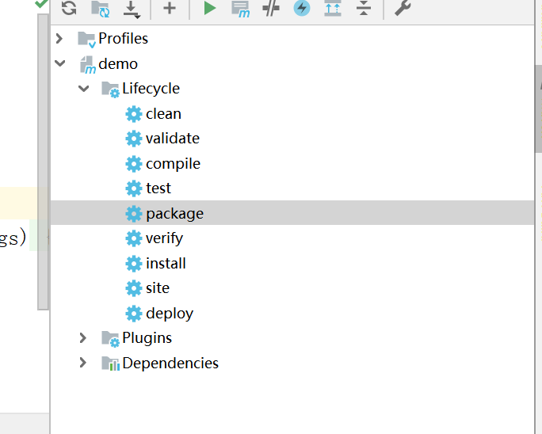

# SpringBoot


### 体验

导入依赖

```xml
    <dependency>
        <groupId>org.springframework.boot</groupId>
        <artifactId>spring-boot-starter-web</artifactId>
        <version>2.1.2.RELEASE</version>
    </dependency>

    <!-- https://mvnrepository.com/artifact/org.springframework.boot/spring-boot-starter-parent -->
    <dependency>
        <groupId>org.springframework.boot</groupId>
        <artifactId>spring-boot-starter-parent</artifactId>
        <version>2.1.2.RELEASE</version>
        <type>pom</type>
    </dependency>

```

编写一个主程序

```java
    @SpringBootApplication
public class Helloworld {
        public static void main(String[] args) {
            //启动Spring应用         SpringApplication.run(Helloworld.class);
        }
}

```

直接编写Controller，运行主函数。

```java
@Controller
@RestController
public class HelloController {

    @RequestMapping("/hello")
    public String hello(){
        return "helloWorld";
    }
}
```

部署

maven添加插件

> 这个插件，可以将应用打包成一个可执行的jar包

```xml
<build>
    <plugins>
        <plugin>         <groupId>org.springframework.boot</groupId>
            <artifactId>spring-boot-maven-plugin</artifactId>
        </plugin>
    </plugins>
</build>
```

点击



在target下可以找到打包后的jar

### 父项目

> 由它来管理Spring Boot应用里面的所有依赖版本
>
> SpringBoot的版本仲裁中心

```xml

  <groupId>org.springframework.boot</groupId>
    <artifactId>spring-boot-starter-parent</artifactId>
    <version>2.1.2.RELEASE</version>
    <type>pom</type>
</dependency>

```

### spring-boot-starter-web

> 帮我们导入了web模块正常运行所依赖的组件

```xml
<dependency>
    <groupId>org.springframework.boot</groupId>
    <artifactId>spring-boot-starter-web</artifactId>
    <version>2.1.2.RELEASE</version>
</dependency>
```


## 常见问题：

WebMvcConfigurerAdapter  不再使用。

如使用进行配置**WebMvcConfigurationSupport** ，那么自动配置将不会生效。要进行额外的配置并且要使自动配置生效可以实现**WebMvcConfigurer** 。

[spring boot 继承WebMvcConfigurationSupport后自动配置不生效问题](https://www.cnblogs.com/deng720/p/8989388.html)

## SpringBoot与jdbc

SpringBoot在org.springframework.boot.autoconfigure.jdbc.DataSourceConfiguration`中对jdbc的数据源进行了自动配置。

springboot2.0以后默认的数据连接池是hikari(ひかり)连接池。

在application.yml中可以配置连接池所需信息

```yml
spring:
  datasource:
    url: jdbc:mysql://103.40.18.90:3306/mybatis?serverTimezone=UTC
    driver-class-name: com.mysql.cj.jdbc.Driver
    username: root
    password: cy1269903329
```

注入jdbcTemplate

```java
  @Autowired
    JdbcTemplate jdbcTemplate;

    @ResponseBody
    @GetMapping("/qeury")
    Map<String, Object> queryAll(){
        List<Map<String, Object>> maps = jdbcTemplate.queryForList("select * from tbl_employee");
        return maps.get(0);
    }
```

注入`DataSource`可以查看DataSource信息，获取连接等。

```java
@Autowired
DataSource dataSource;

@Test
public void contextLoads() throws SQLException {
    System.out.println("dataSource:============>"+dataSource);
    System.out.println("dataSource.getConnection()=========>"+dataSource.getConnection());
}
```